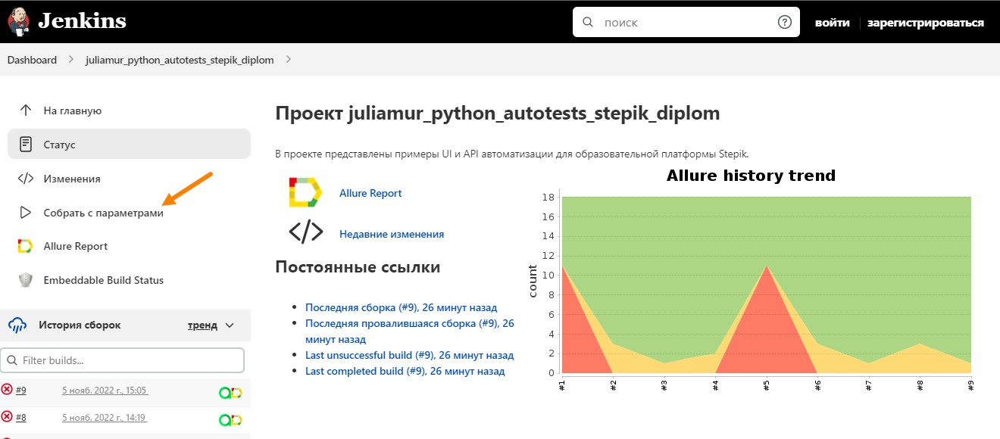
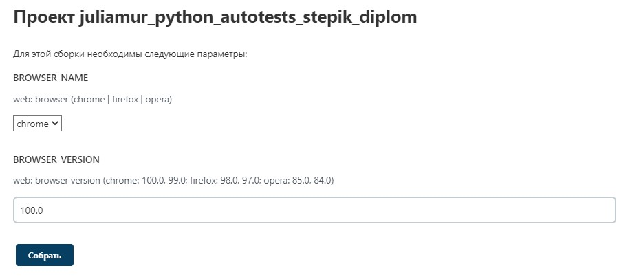
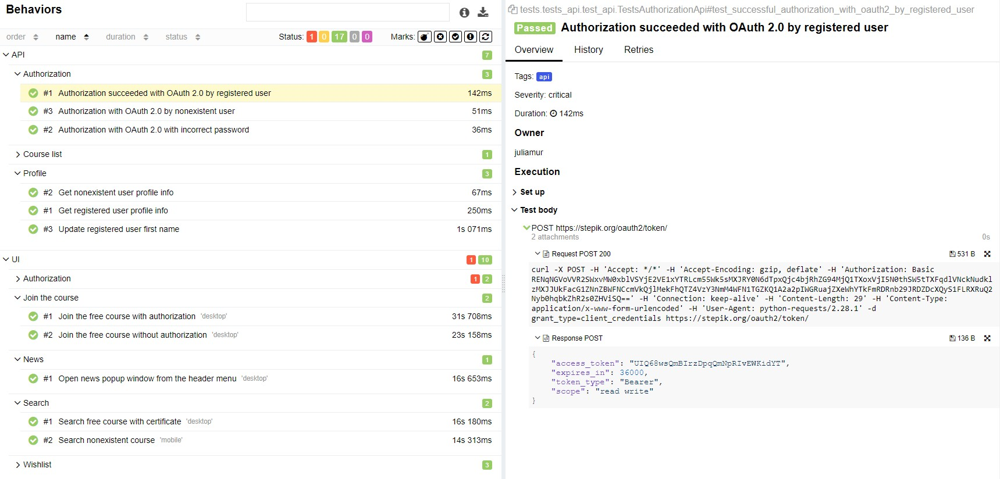
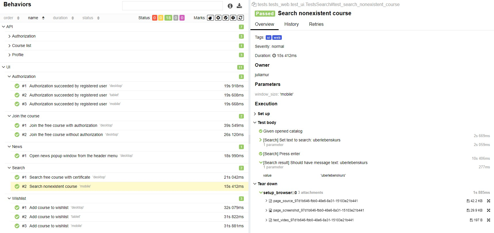
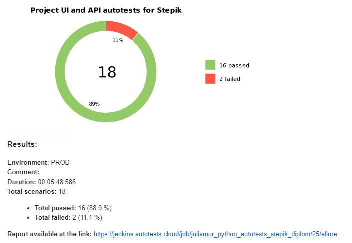
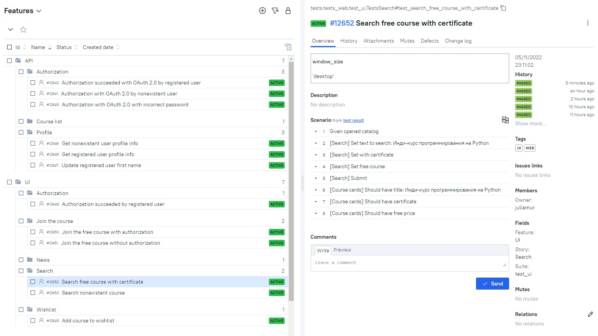
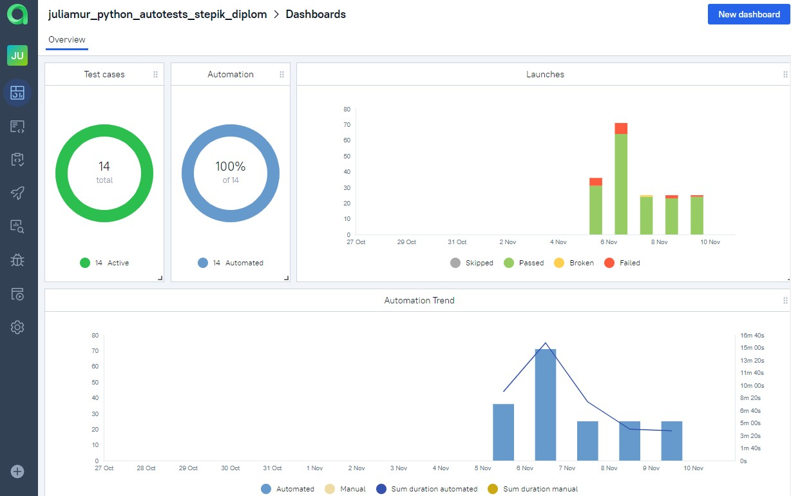
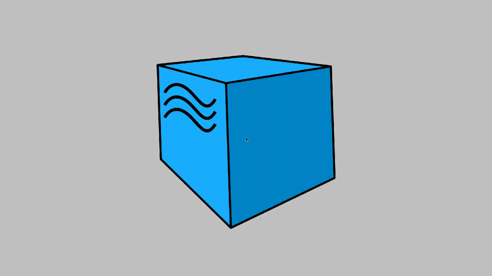

# Пример организации автотестирования для образовательной платформы <a target="_blank" href="https://stepik.org/">Stepik</a>
> Stepik — многофункциональная образовательная платформа и конструктор
онлайн-курсов. Цель платформы — сделать образование открытым и удобным.
Размещено более 700 онлайн-курсов.

## :open_book: Содержание:
- [Описание проекта](#heavy_check_mark-описание)
- [Кратко](#heavy_check_mark-кратко)
- [Технологии и инструменты](#gear-технологии-и-инструменты)
- Что проверяем:
  - [UI](#heavy_check_mark-реализованные-ui-проверки)
  - [API](#heavy_check_mark-реализованные-api-проверки)
- [Запуск тестов из Jenkins](#-запуск-тестов-из-jenkins)
- [Запуск тестов локально](#computer-локальный-запуск)
- Отчеты:
  - [Allure](#bar_chart-отчеты-о-прохождении-тестов-доступны-в-allure)
  - [Telegram](#-telegram)
- [Allure TestOps](#briefcase-проект-интегрирован-с-allure-testops)
- [Видео прогона теста](#movie_camera-пример-видео-прогона-теста)


## :heavy_check_mark: Описание
В проекте представлены примеры UI и API автоматизации тестирования на Python. 
<p>При написании тестов применялись инструменты объектно-ориентированной парадигмы, а также использовался шаблон 
проектирования PageObjects.
<p>Выделены тест-кейсы. Реализована параметризация тестов.
<p>Подключена система отчетности Allure Reports с вложениями (логи, скриншоты, видео, etc). 
В UI-тестах отображено два типа передачи шагов теста в отчет:
 
- Лямбда-степы через with allure.step
- Декораторы @step с автоматическим подтягиванием allure.title из названия функций и их параметров

<p>Также по факту прохождения теста отправляется уведомление с результатами в Telegram и на электронную почту.
<p>Браузер в UI-тестах запускается удаленно в Selenoid.
<p>Реализована интеграция с Allure TestOps.

## :heavy_check_mark: Кратко
- [x] `Page Object` с шагами `Fluent of Invocations`
- [x] `Application Manager`
- [x] Параметризованный запуск тестов
- [x] `Request/response` спецификация для API тестов
- [x] Self-documenting code
- [x] Запуск тестов, используя `Jenkins` и `Selenoid`
- [x] `Allure Reports` с вложениями (логи, скриншоты, видео)
- [x] Логирование requests/responses в `Allure Reports`
- [x] Интеграция с `Allure TestOps`
- [x] Отправка результатов тестирования по `email` и в `Telegram`

## :gear: Технологии и инструменты:

<div align="center">
  &nbsp;
  &nbsp; 
  &nbsp;  
  &nbsp;
  &nbsp;  
  &nbsp;    
  &nbsp;
  &nbsp;
  &nbsp;
  &nbsp;
</div>

## :heavy_check_mark: Реализованные UI-проверки

> - авторизация зарегистрированным пользователем;
> - добавление курса в 'Wishlist';
> - поступление на курс:
>   - авторизованным пользователем;
>   - неавторизованным пользователем;
> - поиск:
>   - бесплатного курса с сертификатом;
>   - несуществующего курса;
> - открытие поп-ап окна 'News' из меню.

## :heavy_check_mark: Реализованные API-проверки

> - OAuth 2.0 авторизация:
>   - зарегистрированным пользователем;
>   - зарегистрированным пользователем с невалидным паролем;
>   - несуществующим пользователем;
> - получение курс-листа по номеру;
> - получение информации профиля:
>   - существующего пользователя;
>   - несуществующего пользователя;
> - изменение имени зарегистрированным пользователем.

##  Запуск тестов из [Jenkins](https://jenkins.autotests.cloud/job/juliamur_python_autotests_stepik_diplom/)

Для запуска тестов из Jenkins:
1. Нажмите кнопку "Собрать с параметрами"

<p></p>

2. Выберите параметры

<p></p>

3. Нажмите "Собрать"

## :computer: Локальный запуск 

1. Склонируйте репозиторий
2. Установите Poetry `poetry install`
3. Откройте проект в PyCharm, установите интерпретатор
4. Создайте `.env` файл по образцу в папке проекта
5. Запустите тесты в PyCharm или в командной строке (не забудьте подставить нужные параметры):
```bash
pytest --browser_name={BROWSER_NAME} --browser_version={BROWSER_VERSION} --alluredir allure-results/
```

### :heavy_plus_sign: Параметры сборки

> - BROWSER_NAME — браузер _(Chrome, Firefox)_, по умолчанию Chrome
> - BROWSER_VERSION — версия браузера _(chrome: 100.0, 99.0; firefox: 98.0, 97.0)_, по умолчанию 100.0

## :bar_chart: Отчеты о прохождении тестов доступны в Allure

> При локальном запуске введите в командной строке: 
```bash
allure serve .\allure-results
```

###  Allure

#### Примеры отображения тестов





###  Telegram

Настроена отправка отчета в Telegram


### Email

Настроена отправка отчета на электронную почту



## :briefcase: Проект интегрирован с Allure TestOps 

#### Автоматически собраны тест-кейсы



#### Представлены дашборды аналитики



## :movie_camera: Пример видео тестового прогона

В отчетах Allure для каждого UI-теста прикреплен не только скриншот, но и видео прохождения теста

<p align="center">
  
</p>

